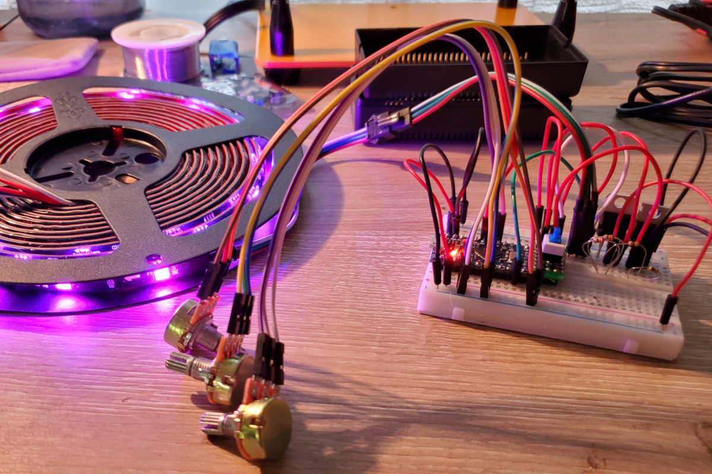

# arduino-rgbctrl

A flexible, scriptable RGB controller that can be reprogrammed over a serial connection.



## Overview

The main goal of this project is to provide a more customizable LED controller than off-the-shelf ones, with modular support
for different types of LED chips. However, I didn't want to have to flash new firmware on the Arduino each time I wanted to change
the output; therefore, I've implemented RGB control in a virtual machine with program memory that persists in EEPROM. The VM program
can be reflashed via a simple serial protocol without reflashing the Arduino itself.

This codebase should work on any AVR based Arduino, though it has only been tested on the Uno, as well as the 16MHz "Pro Micro"
boards which are widely available online.

Features:

- A virtual machine that interprets bytecode which manipulates the state of RGB values.
- Support for taking analog inputs into the VM program.
- EEPROM bytecode storage that the MCU reads back into memory at startup.
- Serial bytecode updater with persistence in EEPROM.
- An assembler that can translate mnemonics to bytecode.
- A simple PWM based driver for controlling an analog RGB LED.
- Drivers for WS281x and APA102/SK9822 addressable LEDs.

TODO:

- Implement a GUI for easily programming and flashing the bytecode.

More information on this project is [available on my blog](https://lo.calho.st/posts/rgb-arduino/).

## Usage

### Overview

RGB control is implemented in assembly for the `rgbvm` virtual machine.

To produce output, an `rgbvm` program must:

1. Initialize a driver on a channel (`init` instruction)
2. Write as many pixels of data to that channel as desired (`write` instruction)
3. Instruct the driver to send the buffered data (`send` instruction)

### Running the assembler

Bytecode can be generated with [assemble.py](tools/assemble.py).
The program takes two arguments: the input assembler script, and the output bytecode filename.

```
python tools/assemble.py input.txt output.bin
```

The assembler depends on the package [bitstruct](https://pypi.org/project/bitstruct/).

### Flashing the VM program

The output from the assembler can be flashed to the Arduino with [flash.py](tools/flash.py).
The program takes two arguments: the input bytecode file, and the serial port the Arduino is on.

```
python tools/flash.py output.bin /dev/ttyACM0
```

The flasher depends on the package [pyserial](https://pypi.org/project/pyserial/).

### Caveats

If there is existing content in EEPROM, the firmware may malfunction due to attempting to interpret it as bytecode. It is recommended to run
the builtin EEPROM Clear sample from the Arduino SDK prior to flashing this software. Technically, only the first two bytes of EEPROM need
to be zeroed to clear the VM's program memory.

## Drivers

### Analog

The `analog` driver runs RGB on pins 9, 10, and 11 respectively through PWM. It is intended for debugging purposes only.

This driver can be activated by passing `0` as the first argument to the `init` instruction.

### WS2811

The `ws2811` driver should work well with all WS281x class LEDs (WS2811, WS2812, WS2812B), though it has only been tested with the WS2811.

This driver can be activated by passing `1` as the first argument to the `init` instruction.

WS2811 is driven by a single data line; the third argument passed to the `init` instruction chooses the digital pin this output is sent to.

Since the WS2811 control protocol requires specific timings, the `send` instruction for this driver has been implemented in AVR assembly. This
code is tuned for a 16MHz Arduino, and thus will not work on an 8MHz chip.

### APA102

The `apa102` driver should work well with APA102 and SL9822 LEDs.

This driver can be activated by passing `2` as the first argument to the `init` instruction.

APA102 is driven by a data line and a clock line; the third argument passed to the `init` instruction specifies the digital pin for the clock
signal, while the next pin in numeric order is implicitly chosen as the data pin.

APA102 chips support specifying a brightness value in addition to the RGB intensity, however this has not been implemented in this driver.

## Building

This project is based on [arduino-cmake](https://github.com/queezythegreat/arduino-cmake) and follows the standard CMake build process:

```
mkdir build
cd build
cmake ..
make
```

The framework conveniently provides `make upload` to flash the Arduino firmware.

## Requirements

* Base requirements:

  - `CMake` - http://www.cmake.org/cmake/resources/software.html
  - `Arduino SDK` - http://www.arduino.cc/en/Main/Software

* Linux requirements:

  - `gcc-avr`      - AVR GNU GCC compiler
  - `binutils-avr` - AVR binary tools
  - `avr-libc`     - AVR C library
  - `avrdude`      - Firmware uploader

## Virtual machine

rgb-ctrl is based on an 8-bit virtual machine called `rgbvm`. It implements an application-specific instruction set, having 15 general purpose registers,
a flag register, an instruction pointer register, a few basic arithmetic operations, color space conversion operations, branching operations, and output controls,
and an instruction that reads analog inputs.

Execution starts at instruction offset 0, resetting to 0 if the end of the program is reached.

All values are treated as unsigned, though the assembler itself supports specifying signed immediate operands.

### Assembler

The assembler currently has a very basic syntax:

- A line starting with `#` is a comment
- A line starting with `:` is a label
- Every other non-empty line is expected to describe an instruction
- Each instruction is a sequence of space-separated tokens
- The first token is an opcode, and subsequent tokens are operands
- If an operand starts with `r`, it is a register; if it starts with a `:`, it is a label; otherwise, it is an immediate

The assembler runs two passes over the source: first, it determines the instruction addresses of all labels; then, it generates code.

Take a look at the example scripts to get an idea of how to use the VM:

- [hue_cycle.rgbvm](scripts/hue_cycle.rgbvm) - loops through all hues
- [value_pulse.rgbvm](scripts/value_pulse.rgbvm) - repeatedly increases the value, then reduces it again
- [ws2811_test.rgbvm](scripts/ws2811_test.rgbvm) - provides an example of controlling a chain with multiple LEDs

### Opcodes

| Mnemonic | Operands           | Description                                                                    |
|----------|--------------------|--------------------------------------------------------------------------------|
| nop      | \[imm\]            | no operation -- if imm specified and nonzero, sleep 2^(imm-1) ms               |
| set      | rdst (rsrc\|imm)   | load register rdst from rsrc or immediate                                      |
| add      | rdst (rsrc\|imm)   | add to rdst from rsrc or immediate                                             |
| mul      | rdst (rsrc\|imm)   | multiply rdst by rsrc or immediate                                             |
| div      | rdst (rsrc\|imm)   | divide rdst by rsrc or immediate                                               |
| mod      | rdst (rsrc\|imm)   | modulo rdst by rsrc or immediate                                               |
| cmp      | r0 (r1\|imm)       | compare r0 to r1 or imm and store the result in flags                          |
| goto     | address            | move the instruction pointer to address                                        |
| brne     | address            | move the ip to address if last comparison was not equal                        |
| breq     | address            | move the ip to address if last comparison was equal                            |
| brlt     | address            | move the ip to address if last comparison was less than                        |
| brle     | address            | move the ip to address if last comparison was less or equal                    |
| brgt     | address            | move the ip to address if last comparison was greater than                     |
| brge     | address            | move the ip to address if last comparison was greater or equal                 |
| hsv2rgb  | rh rs rv           | convert hsv values in registers to rgb (in place), each of hsv in [0, 255]     |
| init     | immd immc \[immf\] | initialize output channel immc with driver number immd and optional flags immf |
| write    | rr rg rb immc      | buffer rgb value from registers on output channel immc                         |
| send     | immc               | activate the buffered output of immc                                           |
| input    | rdst immpin        | load rdst with the value from the analog pin numbered by the immediate         |


## License

This Source Code Form is subject to the terms of the Mozilla Public
License, v. 2.0. If a copy of the MPL was not distributed with this file,
You can obtain one at http://mozilla.org/MPL/2.0/.
